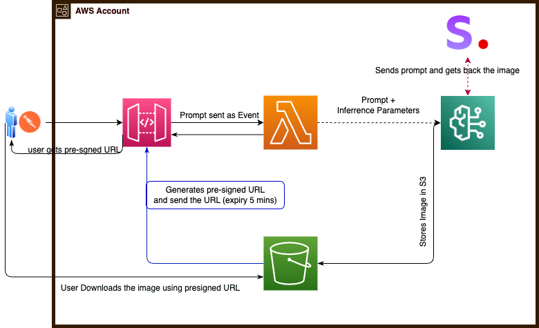
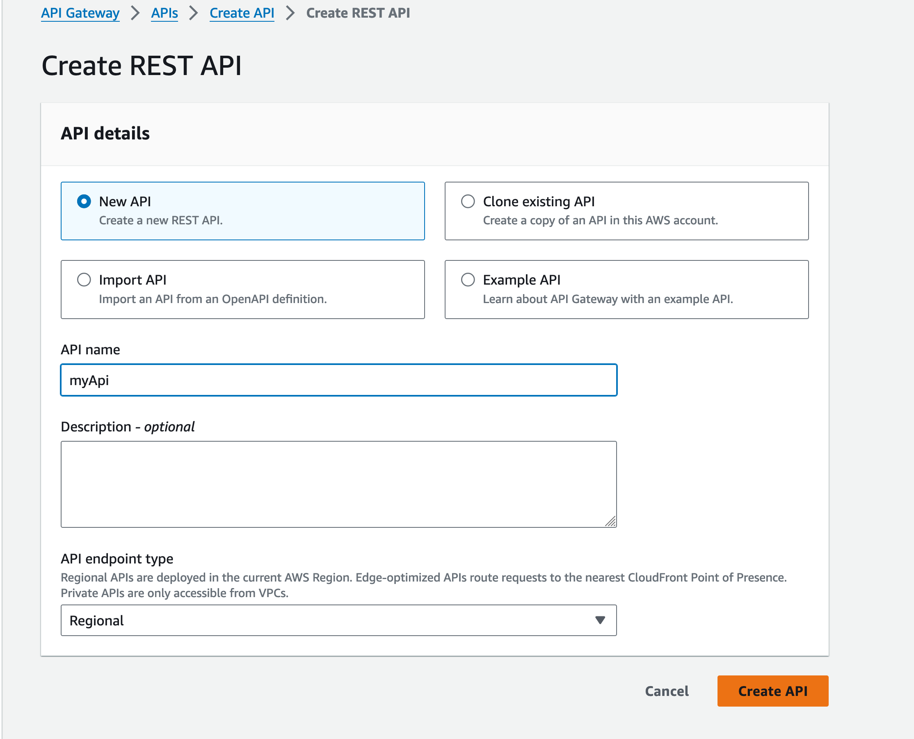

# Generate Image using Amazon Bedrock (Stabiliy AI)

High Level Architecture





# Steps


## Update boto3 version in Lambda.

Follow this [instruction](https://repost.aws/knowledge-center/lambda-python-runtime-errors )
Note down the lambda ARN :
* We need to add this as a layer to our lamba function so that our function uses updated/upgraded boto3. 
* increase the timeout from 3 sec (default) to something higer (1 min or so). 3 sec is very less in our use case. 
* When the function was created, a associated IAM role was automatically created. We need to add permission(s) to that role. 
Add AmazonBedrockFullAccess and AmazonS3FullAccess permission. For Production, instead of AmazonS3FullAccess, we can give granular access. Bedrock & S3 permission is required becuase Lambda will reach out to Bedrock to generate image and store the to S3, and also generate presigned URL. 

## Create the lamda function

```
Python Code that needs to be used in lambda is placed [HERE](Lambda_pythone.py)
```

> Above code will create a lamda fuction that
>> 1) Takes input as Prompt
>> 2) passes the same to bedrock to generate image
>> 3) Stores the same image in S3 with Unique Name
>> 4) Generate a pre-signed URL and resturns. 
>

---

## Create API Gateway. 

### Create an REST API 



### Create Resource


### Create Method


### edit Method Request


### Edit Integration request
 


### Deploy the API
Deploy the API to any Stage (i.e. Stage=Test or any other)

### Test

Now its ready to tested through console or other API tool such as Postman


